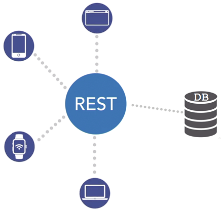
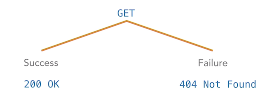
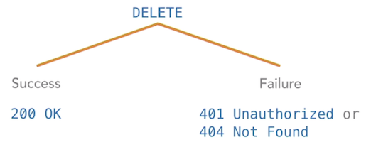
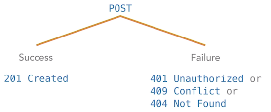
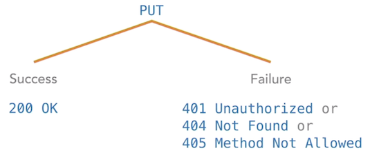

---?color=black
@title[Title]

@snap[west headline text-white span-70]
REST APIs
@snapend

@snap[south-west]
@fa[envelope-o pad-right-icon]@css[contact-email](thomas.devine@lyit.ie)
@snapend

---
@title[Contents]
### Contents

@ol[](false)
- Why REST APIs?
- What is REST API?
- REST API Verbs
- A REST API using Node Express


@olend

---
@title[Contents]
### Contents

@ol[](false)
- **Why REST APIs?**
- What is REST API?
- REST API Verbs
- A REST API using Node Express


@olend

---
@title[Why REST APIs?]

### Why REST APIs?

@ul[list-bullets-black](true)
- They're used in these applications:
  - social media apps e.g. Twitter, Facebook, etc.
  - news websites
  - flight booking systems
  - video streaming services e.g. Netflix
- You can get @size[1.5em](data) from service providers with different clients using @size[1.5em](REST) (or RESTful) @size[1.5em](APIs).
@ulend

---
@title[Contents]
### Contents

@ol[](false)
- Why REST APIs?
- **What is REST API?**
- REST API Verbs
- A REST API using Node Express


@olend

---
@title[What is REST API?]

### What is REST API?

@ul[list-bullets-black](true)
- Imagine a DB server where people want to add, update, or delete data
- On one side we have the @size[1.5em](clients) e.g. browser, webapp, watch, fridge, etc.
- On the other side we have the database @size[1.5em](server)
- In the middle sits the REST API
@ulend

---
@title[What is REST API?]

### What is REST API?



---
@title[What is REST API?]

### What is REST API?

@ul[list-bullets-black](true)
- A REST API receives, processes, and handles requests and responses
- Typically the server is a database
- When a REST service runs on the web over HTTP it's sometimes called a RESTful API

@ulend


---
@title[What is REST API?]

### What is REST API?

**RE**presentational **S**tate **T**ransfer **A**pplication **P**rogramming **I**nterface.

REST isn't a specific technology, but a data architecture

> REST APIs produce predictable and consistent outputs and behaviors by receiving a set of standard methods called **VERBS** and returning standardised structured data, typically as a **JSON** resource.


---
@title[Contents]
### Contents

@ol[](false)
- Why REST APIs?
- What is REST API?
- **REST API Verbs**
- A REST API using Node Express


@olend

---
@title[REST API Verbs]

### REST API Verbs

@ul[](false)
- ``GET``
- ``POST``
- ``DELETE``
- ``PUT``
- ``PATCH``
- ``OPTIONS``
- ``HEAD``

@ulend

Let's see examples for the some of them...

---

``GET`` https://localhost/students/00909693

GET student whose id is 00909693. Returns:

```javascript
{
   "id": "00909693",
   "name": "Joe Bloggs"
}
```



---

``DELETE`` https://localhost/students/00909693

DELETE the student whose id is 00909693




---

``POST`` https://localhost/students

POST a new student with details:

```javascript
{
   "id": "00123456",
   "name": "Jane Doe"
}

```



---

``PUT`` https://localhost/students/00123456

PUT (replace) this student content

```javascript
{
   "name": "Jane Bloggs"
}
```
Jane changed her name to Jane Bloggs





---
@title[Contents]
### Contents

@ol[](false)
- Why REST APIs?
- What is REST API?
- REST API Verbs
- **A REST API using Node Express**


@olend

---
@title[ REST API using Node Express]
###  REST API using Node Express

Run and Describe [RESTAPI Demo](https://github.com/barcaxi/WD12019/tree/master/restapi/restapiONE)


---
@title[Exercise]
### Exercise


Run and understand the REST API demo.

[@fa[external-link]](https://github.com/barcaxi/WD12019/tree/master/restapi/restapiONE)

---
@title[POSTMAN]
### POSTMAN

- The **Postman** Chrome extension helps send and receive HTTP requests
- We can use it to test the functionality of a REST API server
- It saves time having to create HTML forms, etc.
- Postman demo with REST API...

[@fa[external-link]](https://github.com/barcaxi/WD12019/tree/master/restapi/restapiONE)


---
@title[REST API with a DB]
###  REST API with a DB

Run and Describe [RESTAPI DB Demo](https://github.com/barcaxi/WD12019/tree/master/restapi/restapiONEdb)


---
@title[Exercise]
### Exercise

Run and understand the REST API DB demo.

[@fa[external-link]](https://github.com/barcaxi/WD12019/tree/master/restapi/restapiONEdb)


---
@title[Exercise]
### Exercise

- Update the REST API DB demo to show all teams in a HTML table in Home page
- Update the REST API DB demo to ``POST``, ``PUT`` and ``DELETE``

[@fa[external-link]](https://github.com/barcaxi/WD12019/tree/master/restapi/restapiONEdb)


---?color=black
@title[The End]

@snap[west headline text-white span-70]
REST APIs
@snapend

@snap[south-west]
@fa[envelope-o pad-right-icon]@css[contact-email](thomas.devine@lyit.ie)
@snapend

